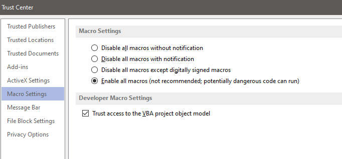

Installation & Requirements
#############################

Requirements
==================

	1. python >= 3.9
	2. MS-Excel
	3. MS-Visio
	4. Visio stencil(s)
	5. Jinja Templates

-----------------

Installation
==================

Install the nettoolkit package using pip::

    pip install --upgrade nettoolkit
	
There are many other ways to install packages such as conda install or manual wheel file download and install.
You can do it as per your prefered choice of installation.
	

---------------------------

Inherited python packages
====================================

	* pandas
	* openpyxl
	* PySimpleGUI
	* numpy
	* xlrd
	* pywin32
	* jinja2
	* paramiko
	* netmiko
	* ntc-templates
	* compare-it

-------------------------------------

Do this: Enable Macros for MS-Visio
***********************************

Enable all macros from Trust Center settings in order to allow visio access for script. ( in case if access error )

