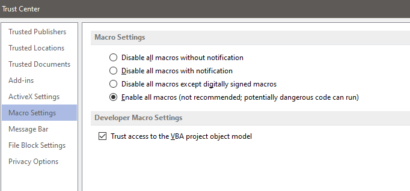

Installation & Requirements
#############################

Requirements
==================

	1. python >= 3.9     ( Tested with python 3.10 )
	2. MS-Excel          ( Tested with Office 365  )
	3. MS-Visio          ( Tested on MS Visio2013  )
	4. Visio stencil(s)  ( Free available on web   )
	5. Jinja Templates   ( Create your own - samples given )

-----------------

.. figure:: images/nettoolkit_logo.jpg
   :scale: 5%
   :alt: Nettoolkit
   :align: right

Installations
==================

Install the nettoolkit package using pip::

    pip install --upgrade nettoolkit
	
There are many other ways to install packages such as conda install or manual wheel file download and install.
You can do it as per your prefered choice of installation.

Just in case if you are running windows OS and pip is not in your path, than above may throw error. You can intall it with python -m in such case

Example::

    python -m pip install --upgrade nettoolkit

Install windows os library for python::

    pip install --upgrade pywin32
	# or 
    python -m pip install --upgrade pywin32

This is mandatory for MS-visio drawing generation. And it will work only on **windows** platforms.

---------------------------

Inherited python packages
====================================

	Below are a few inherited packages by Nettoolkit.  By default those will also get auto install along with Nettoolkit except pywin32.
	However just in case if any of these are missing and could not installed, please try to manually install those with pip install command as mentioned above.

	* pandas         ( Tested on - 2.3.1 )
	* openpyxl
	* numpy          ( Tested on - 2.2.6 )
	* xlrd
	* pyyaml
	* attrs
	* jinja2
	* paramiko
	* netmiko
	* ntc-templates
	* jumpssh
	* tabulate
	* colorama
	* pyfiglet
	* pywin32        ( manual install required - this is to interact with MS office apps )

-------------------------------------

Do this: Enable Macros for MS-Visio
***********************************

Enable all macros from Trust Center settings in order to allow visio access for script. ( Optional, Only in case if access error ) 

