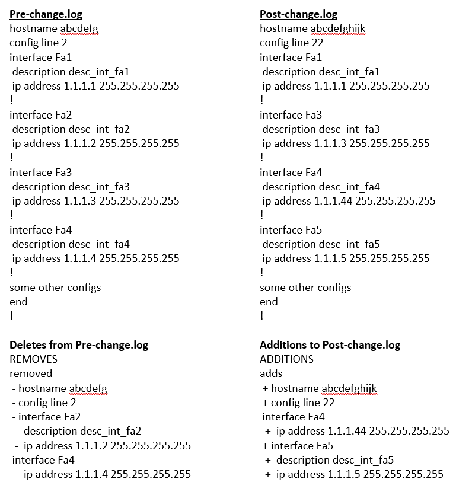
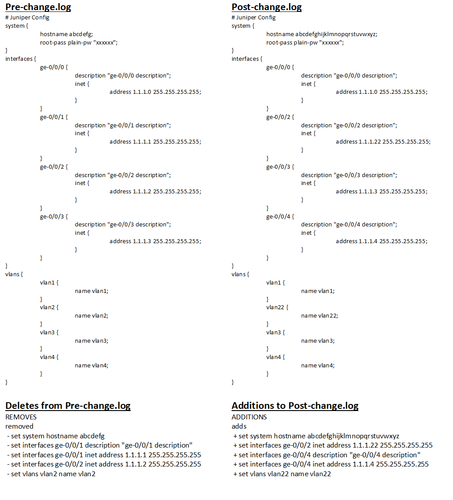

Compare two Text files for differences
============================================

**Example Use Case:** Compare Pre/Post configuration files and provides differences between two configuration files

Here is how to do

Sample Execution Code for text configuration Compare
----------------------------------------------------

.. code-block:: python
    :emphasize-lines: 2,17,18,19,20,23,26

    # Import necessary modules
    from nettoolkit.compare_it import CompareText, get_string_diffs
    from nettoolkit import IO

    # Define Input fies.
    f1 = 'pre-change-config.log'
    f2 = 'post-change-config.log'
    output_file = "delta_differences.txt"

    # Define output headers
    header = f"\n# {'-'*80} #\n" + f"# {' '*20} Difference : [{output_file.split('.')[0]}]" + f"\n# {'-'*80} #\n"
    removal_header = f"\n# {'- '*20} #\n" + f"# {' '*15} REMOVALS"  + f"\n# {'- '*20} #\n"
    addition_header = f"\n# {'+ '*20} #\n" + f"# {' '*15} ADDITIONS" + f"\n# {'+ '*20} #\n"

    # Compare two files for adds/removals usng "CompareText"
    diff = {}
    removals = CompareText(f1, f2, "- ")
    adds = CompareText(f2, f1, "+ ")
    diff[removal_header] = removals.CTObj.diff
    diff[addition_header] = adds.CTObj.diff

    # Convert  dictionary to string format using "get_string_diffs"
    diff_str = get_string_diffs(diff, header=header)

    # Write the text difference now to a text file using "nettoolkig.IO"
    IO.to_file(output_file, matter=diff_str)

Snap of Execution for Cisco Style configurations
---------------------------------------------------

Snap of Execution for Juniper Style configurations
---------------------------------------------------

