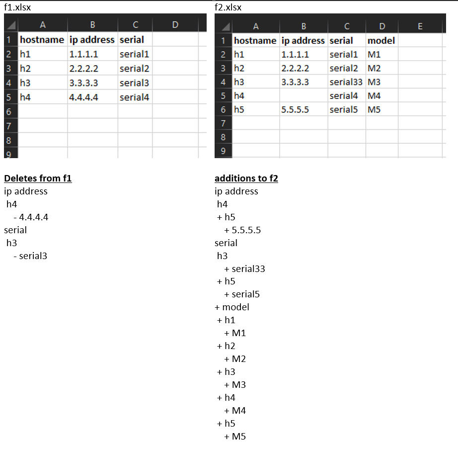

Compare two Excel File / Sheet for differences
===============================================

**Example Use Case:** 

Compare Pre/Post captured -clean files tabs and provides differences

Sample Execution Code for XL Compare
--------------------------------------

.. code-block:: python
	:emphasize-lines: 1, 4, 11,12, 19, 23

	# # Step. 1: Import necessary modules
	from nettoolkit.compare_it import CompareExcelData, get_string_diffs

	# # Step. 2: Define Inputs
	f1 = "f1.xlsx"
	f2 = "f2.xlsx"
	sheet_name = "Sheet1"
	index_col = "hostname"
	output_file = "differences.txt"

	# # Step. 3: Compare two files for adds/removals usng "CompareText"
	# #        : Differences wil be generated based on index column.
	diff = {}
	removals = CompareExcelData(f1, f2, sheet_name, "- ")	# removals from file1
	adds = CompareExcelData(f1, f2, sheet_name, "+ ")	# adds to file 2
	remove_diff = removals.diff(index_col)
	add_diff = adds.diff(index_col)

	# # Step. 4: convert the dictionaries to string format using "get_string_diffs"
	removals_str = get_string_diffs(remove_diff, "")
	adds_str = get_string_diffs(add_diff, "")

	# # Step. 5: Print out differences as text or write to a file using "nettoolkig.IO"
	print(removals_str)
	print(adds_str)

Snap of Execution for Excel files comparisions
---------------------------------------------------

