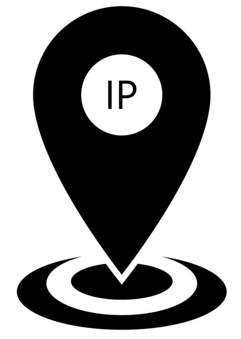
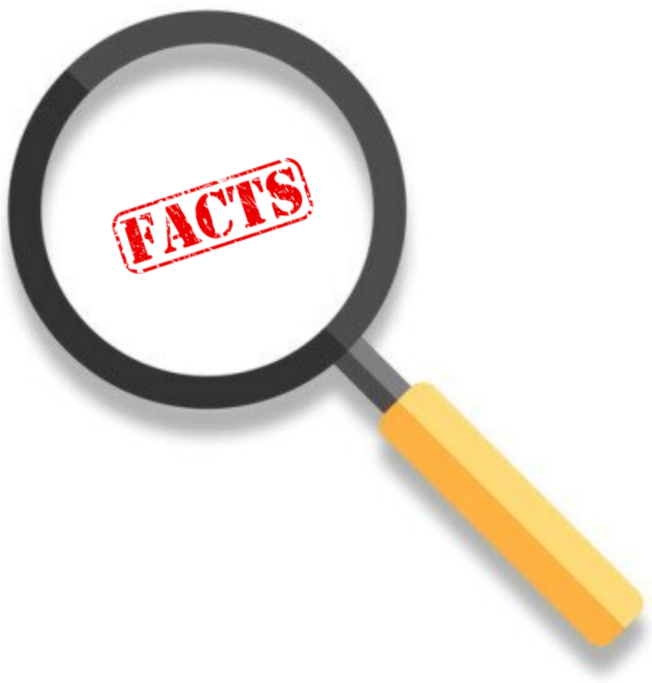
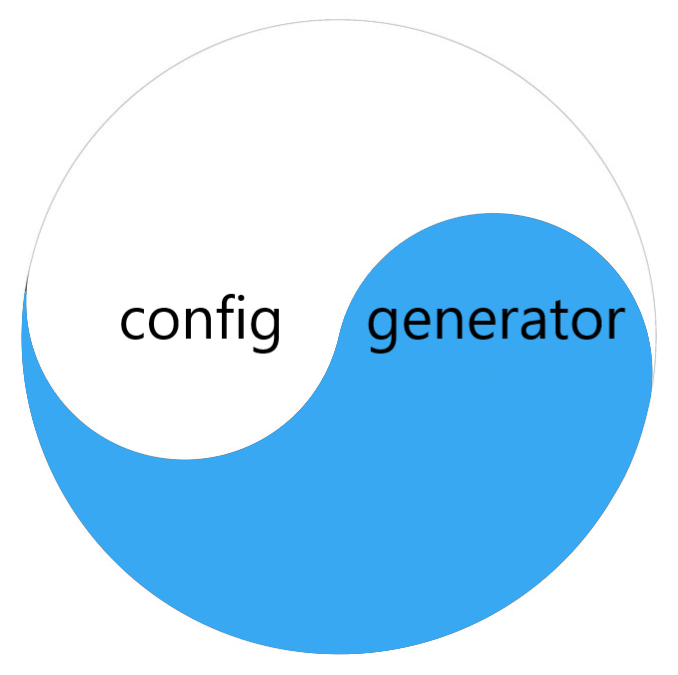
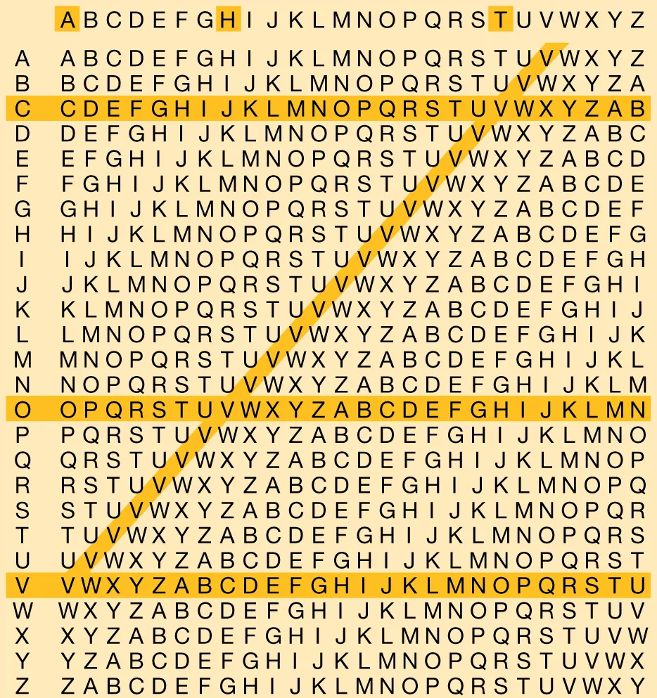
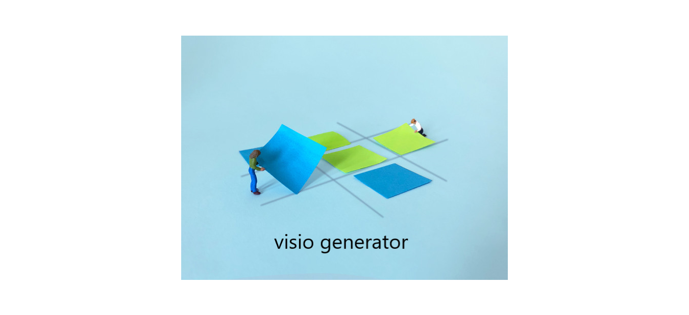

Curious User documentation!
#################################################

`Addressing <addressing/userdoc.html>`_

   * A module which helps define standard IPv4 and IPv6 objects, and allowing various operations on to it.
   * A few Examples: 

      * Find a specific n-th ip from provided subnet
      * Get a range of ip addresses from a prefix
      * Summarize prefixes, Add to Adjacent prefixes
      * Break Prefix in to smaller units
      * IP Scanner,  scanned output comparator.
      * And many more..

---------------

`Capture-IT <capture_it/userdoc.html>`_

   * A module use to capture the show commands from network device(s) ( cisco, juniper, arista )
   * Define device, commands list in text files, and ready to Go. 
   * Or Prepare excel file with standard inputs, and ready to Go.
   * Fork in your custom package to add variable input commands in to commands list 
   * Many more Keys/Options available. Explore further. 

---------------

`Facts-Finder <facts_finder/userdoc.html>`_

   * A Ninja module use to get device configuration parameters parsed in to an Excel (clean) file.
   * Many more keys available, Explore.
   * Custom Package can be forked in to dynamically add more output in clean excel file.
   * Generated clean files can be used for various other applications.

---------------

.. figure:: configure/files/configure.png
   :scale: 25%
   :alt: configure via line
   :align: right

`Configure <configure/userdoc.html>`_

   * A module use to push the delta changes to device using ssh ( cisco/ juniper)
   * Batches can be created in order to push the configurations order wise.
   * Explore Further

---------------

`Compare-IT <compare_it/userdoc.html>`_

   * A module use to do the comparision between two text or excel files.
   * Compare two Text files to retrive changes between two. ( useful in preparation of Delta changes between two configurations. (cisco/juniper) )
   * Compare two Excel files to find out what values got changed in between.( useful in finding pre/post change analysis for device clean fact files )

---------------

`Config-Gen <j2config/userdoc.html>`_

   * A module use to generate the device configuration file, using Jinja template & Excel databse.
   * Custom package can be fork in to add more custom filters for Jinja.
   * Explore Further

---------------

`Juniper <pyjuniper/userdoc.html>`_

   * A module which defines various juniper specific operations.
   * Convert Juniper standard bracket configuration to set command configurations.
   * Remove Remarks from configurations. 
   * etc. Check further.

---------------

`Nettoolkit Class Extensions <nettoolkit/userdoc.html>`_

   * An extenstion functions module to standard python library.
   * Many custom functions and classes defined under this umbrella. 
   * Watch and understand.

---------------

`Crypto <pynetcrypt/userdoc.html>`_

   * A module which help working on Cryptology
   * Simple Password Encryption/Decryption
   * MD5 Hash Generator. 
   * File password masking etc..

---------------

`Cable Matrix Generator <cable_matrix/cable_matrix.html>`_

   * A module use to generate standard Cable Matrix Excel file using the devices clean files.
   * Auto detects link types, SFP etc and fills gaps. 
   * There are many other functions to it. Find out.

`Visio Drawing Generator <pyvig/userdoc.html>`_

   * A module which Generates MS-Visio drawing using the Cable-Matrix.
   * Many options are there to fine tune your drawing output
   * Custom Package can be forked in to dynamically define and create multi-tab output file.