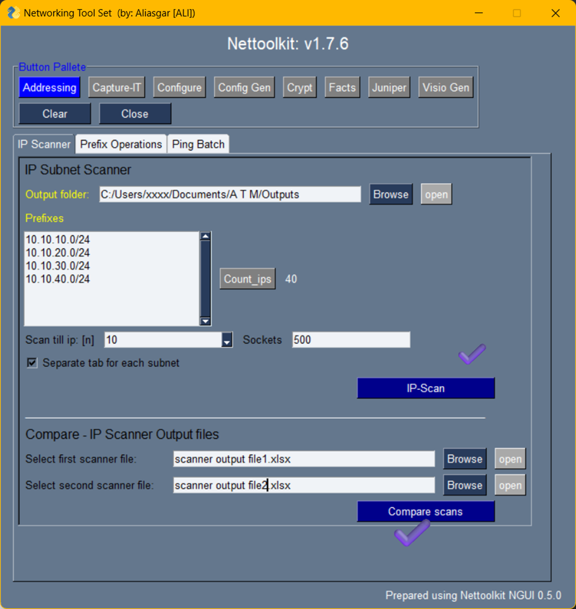
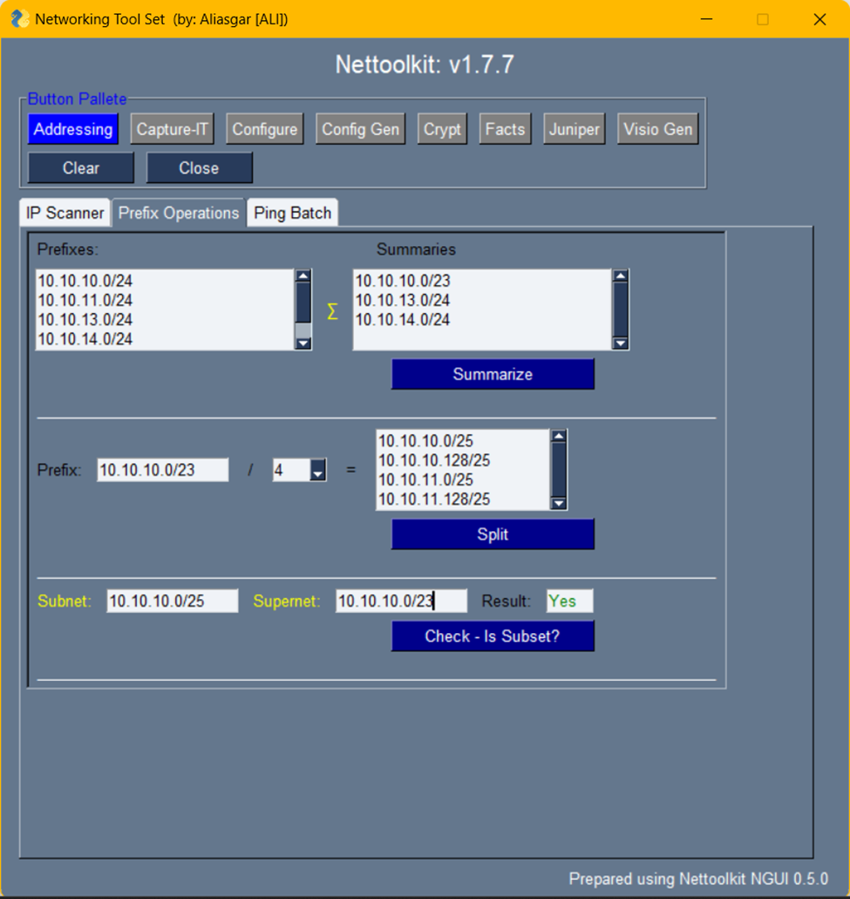
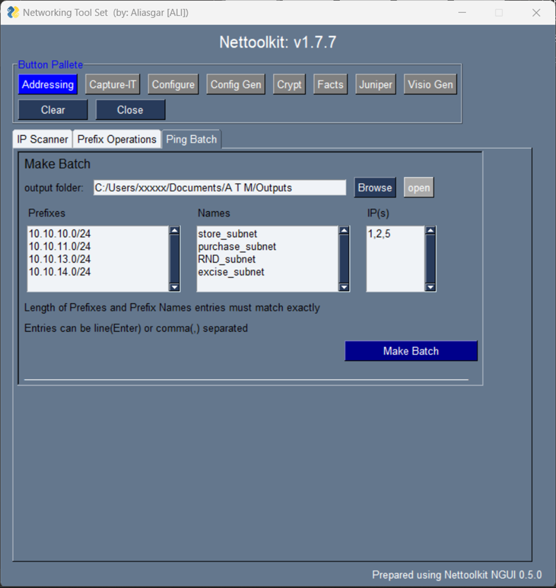

Image Gallery - addressing
###############################################

Enjoy IP Addressing calculations at your finger tips. Below are a few minitools which helps doing such tasks.

#. IP-Scanner  & Compare Two scanner outputs.

+-----------------------------------------------------------------------------+
| **IP Subnets Scanner**                                                      |
+=============================================================================+
|Use this for subnet(s) ip scan for bunch of subnets at at time               |
|                                                                             |
|  * **inputs:** list of subnets;                                             |
|    output folder: output result path;                                       |
|    [n]: to ping only first n number of ips only from all provided subnets;  |
|    Concurrent connections: alter based on pc and network performace/ability;|
|    checkbox: to create separate tab for each individual subnet or to club   |
|  * **output:** Excel output file with ping results                          |
+-----------------------------------------------------------------------------+

+-----------------------------------------------------------------------------+
| **IP Subnet scan comparator**                                               |
+=============================================================================+
| Use this to quickly compare and see differences between two ip scanner      |
| outputs                                                                     |
| Note: differences will be displayed on screen and on console                |
|                                                                             |
|  * **input:** two ip scanner output excel files                             |
|  * **output:** differences on screen/console                                |
+-----------------------------------------------------------------------------+

#. Prefix Operations.

+-----------------------------------------------------------------------------+
| **Create Summaries**                                                        |
+=============================================================================+
|Want to create summaries for the list of prefixes?                           |
|This is perfect spot for you.                                                |
|                                                                             |
|  * **input:** List of prefixes to be summarized                             |
|  * **output:** summaries of provided prefixes                               |
|                                                                             |
+-----------------------------------------------------------------------------+

+-----------------------------------------------------------------------------+
| **Break the prefix**                                                        |
+=============================================================================+
|Want to split the subnet in to multiple pieces?                              |
|This is what you are looking for.                                            |
|                                                                             |
|  * **input:** a Subnet/Supernet to be broken in to                          |
|    /n: number of pieces to be broken subnet in to                           |
|    - n will be considered to the power of 2                                 |
|  * **output:** list of broken subnets                                       |
+-----------------------------------------------------------------------------+

+-----------------------------------------------------------------------------+
| **isSubset**                                                                |
+=============================================================================+
|This is to check, if a subnet is part of another subnet or not               |
|Result will be boolean - Yes/No                                              |
|                                                                             |
|  * **input:** Two prefixes, (one subnet, one supernet)                      |
|  * **output:** Yes/No                                                       |
|                                                                             |
+-----------------------------------------------------------------------------+

#. Ping Batch.

+-----------------------------------------------------------------------------+
| **Create Ping batch script file**                                           |
+=============================================================================+
| Want to keep a continuous ping for list of ip addresses?                    |
| This section will help you preparing an execuatable batch file for that     |
| Note: if any existing batch found with same name, it will be overwrite      |
|                                                                             |
|  * **input:** List of prefixes: from which ips requires to be ping          |
|    Prefix List names: provide this to identify which prefix belongs to what |
|    IP(s): list of n-th ips to be include from each prefix provided          |
|    output folder: where resulted batch file is to be created                |
|  * **input:** List of prefixes from which ips requires to be ping           |
|  * **output:** result batch file(s)                                         |
+-----------------------------------------------------------------------------+

