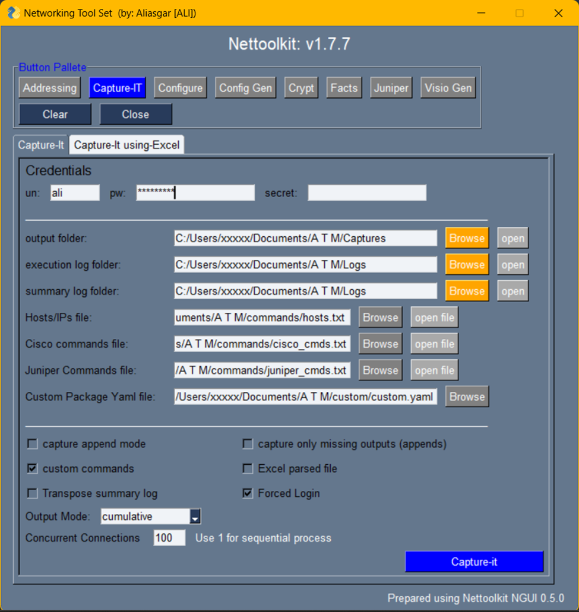

Image Gallery - capture-it
###############################################

* A Utility which helps capturing the show commands output from Cisco and Juniper devices efficiently.
* Multiple devices can be accessed parallelly to achieve it quickly.

Here are a few Keys to understand.

* output folder: Folder where all device show commands output captures will reside.
* execution log folder: Folder where each individual device execution log will be stored.
* summary log folder: Folder where summary log (text and excel) of all device execution will be stored.
* hosts/ip file, cisco commands file, juniper commands file: Provide file reference where those are located. and open it to edit.
* custom package yaml file: Yaml file containing custom package and class listing. ( more details below )
* append: use this key if don't want to loose previous capture, but want to append the new captures to it.
* capture only missing outputs: use this key if want to re capture only a few missing commands and want to avoid duplicate outputs.
* run custom dependent commands: Enable it to access custom class to derive custom commands for captures. will be skipped otherwise.
* excel parsed file: Enable it to parse the capture output and extract information in excel clean files.
* transpose summary log: Summary log will be transpose format in excel. ( Device v/s Commands )
* forced login: Enables to try ssh device even if device ping was unsuccessful.
* output mode: Define output format. ( Either individual files for each commands output, or club all in a single file, or both )
* concurrent connections. : Set it as per your choice and device/network capability.

----

---

**Sample of customer.yaml**

.. code::

   capture_it:
      custom_dynamic_cmd_class: !!python/name:custom_captureit.cisco_bgp.CiscoBgp ''

   facts_finder:
      CustomDeviceFactsClass: !!python/name:custom_factsgen.CustomDeviceFacts ''
      foreign_keys: !!python/name:custom_factsgen.FOREIGN_KEYS ''

Where,
we have a class named *CiscoBgp* in cisco_bgp module at custom_captureit package. [ referenced as **custom_dynamic_cmd_class**]
And, we have a class named *CustomDeviceFacts* in a package custom_factsgen. [ referenced as **CustomDeviceFactsClass**]
Similarly, we have a dictionary defined named *FOREIGN_KEYS* in a package custom_factsgen. [ referenced as **foreign_keys**]

**custom_dynamic_cmd_class:** A class that work on existing command capture, and possess a property **cmds**, which will in turn returns
other additional commands for which output to be taken

**CustomDeviceFactsClass:** A class which takes cleaned facts dictionary  as argument and work on it, to derive the additional custom attributes,
required to be added to clean output file.
**foreign_keys:** A Dictionary with list of additional fields required to be added to clean excel file. ( custom fields mentioned here, only those will be permitted to be add in clean files.)
FOREIGN_KEYS = {
'bgp':[ "router_id", ],
'vrf':["vrf_vpnid", "vrfcolor", ],
'interfaces':[ "int_type",  "int_type", "int_description", ],
}

