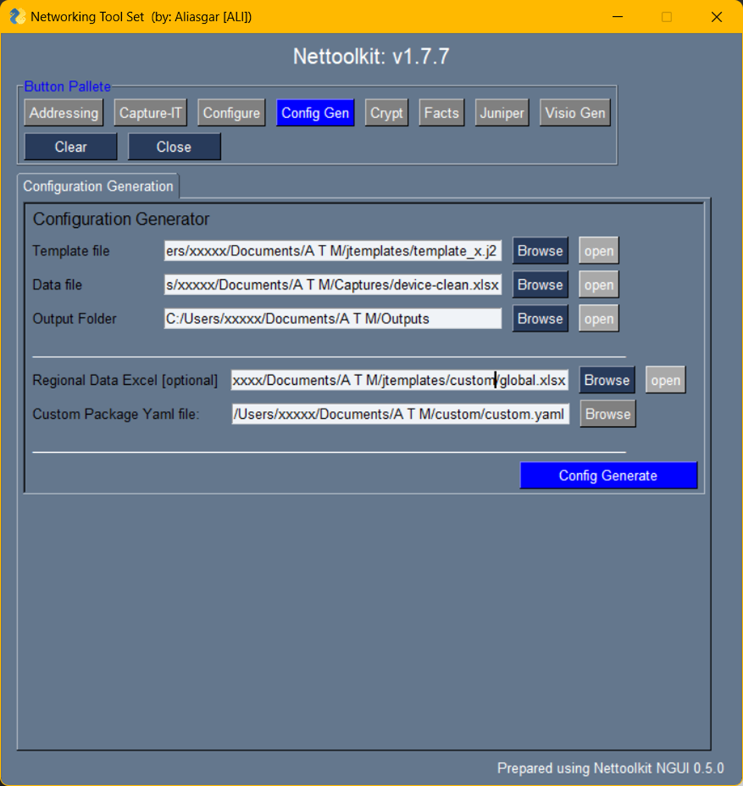

Image Gallery - configurations generator
###############################################

aka: j2config

* A Utility which helps generating configuration of any device using excel database and devie jinja template.
* It can be used for *cisco, juniper, arista, switches, routers, firewalls* and arbitrarily *any device* which supports *cli* configuration..

Here is a few Keys and requirements to understand.

* Template File: Jinja Template file for the device. 
* Data File: Excel database with variable/value reference to it.
* Output Folder: where configuration output to be stored.
* Regional Database: An excel file containing some common variables data.
* custom package yaml file: Yaml file containing custom package and class listing. ( more details below )

----

---

**Sample of customer.yaml**

.. code::

   j2_class_filters:
      Summaries: !!python/name:custom_j2config.classes.Summaries ''
      Block: !!python/name:custom_j2config.classes.Block ''
      Vrf: !!python/name:custom_j2config.classes.Vrf ''
      Vlan: !!python/name:custom_j2config.classes.Vlan ''
      Bgp: !!python/name:custom_j2config.classes.Bgp ''
      Physical: !!python/name:custom_j2config.classes.Physical ''
 
   j2_functions_filters:
      ipv6_acl_name: !!python/name:custom_j2config.ipv6.ipv6_acl_name ''

   j2_regional:
      regional_class: !!python/name:custom_j2config.regional.Region ''

   # add more as necessary

Where,
we can have a few classes defined under category **j2_class_filters**
   
   * Here *Summaries, Block, Vrf, Vlan, Bgp, Physical* are classes present in classes module in a package custom_j2config. And referenced with its own names.

we can have a few functions defined under category **j2_functions_filters**
   
   * Here *ipv6_acl_name* is a function present in ipv5 module in a package custom_j2config. And referenced with its own names.

Similarly, a regional class is referenced as **regional_class** under j2_regional.

These classes and functions will get forked into Jinja Templates automatically.
