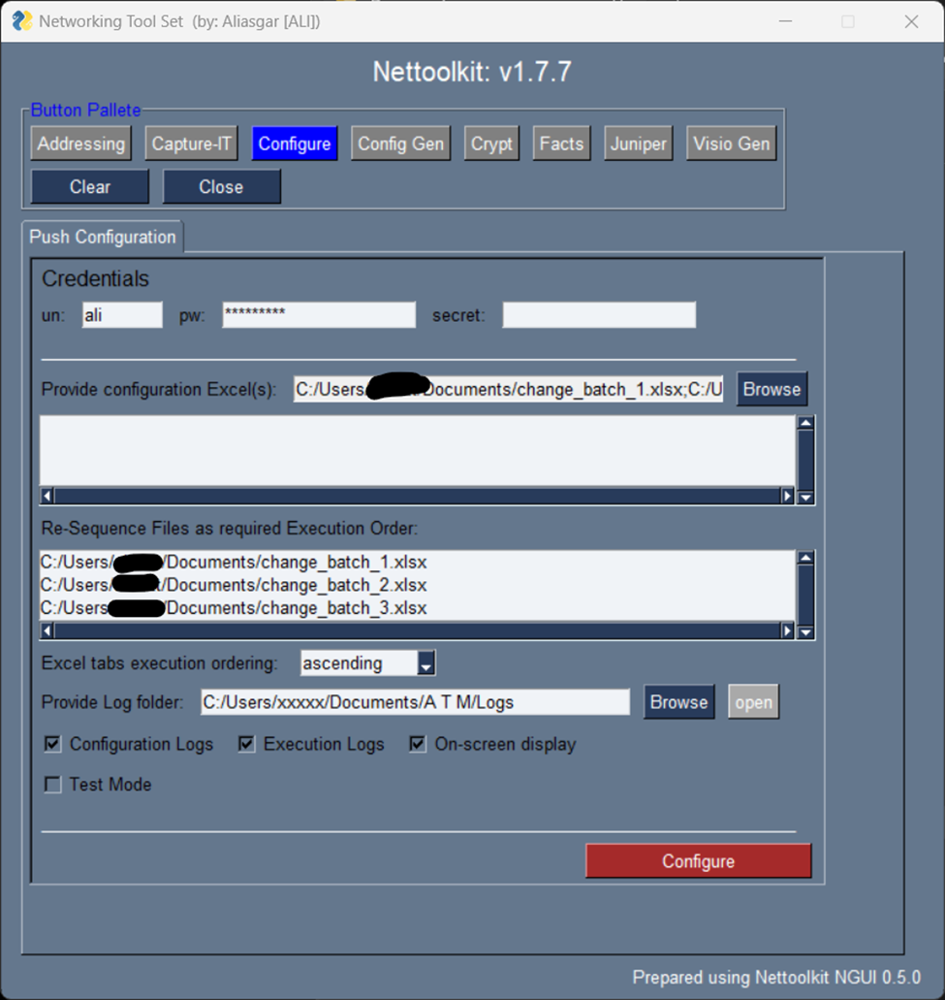

Image Gallery - configure-it
###############################################

* A Utility which helps pushing the configuration to Cisco and Juniper devices using ssh.
* Multiple devices can be accessed parallelly to achieve it quickly.
* Devices can be grouped together to process batch wise.
* SLOW WARNING: Since it is using ssh and not netconf, it is slower.

Here are a few Keys to understand.

* configuration files: Select all excel configuration files ( first row=device ip, rest rows=delta to apply to that device)
* Resequence the files, as per execution batch order required. ( files in the sequenced/below pane only will be considered. ) 
* Excel tab Execution ordering: Ascending/Descending order if a single Excel has multiple tabs.
* Log folder: where execution logs will be stored.

----

