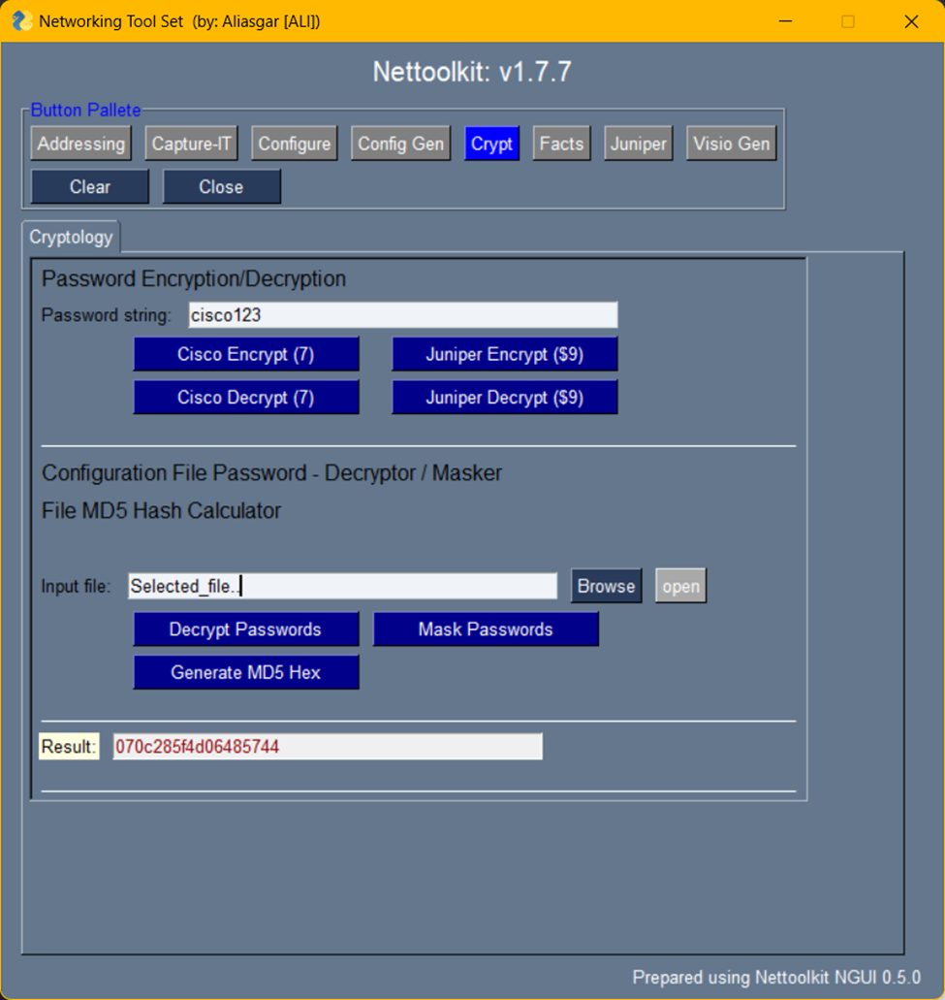

Image Gallery - Crypt
###############################################

+-----------------------------------------------------------------------------+
| **Password Encryption/Decryption Utility**\                                 |
+=============================================================================+
|  #. Cisco type-7 hash decrypt/encrypt                                       |
|  #. Juniper $9 password decrypt/encrypt                                     |
|     Note: Generated encrypted string can be different each time.            |
|                                                                             |
|  #. Decrypt/Mask Cisco file password                                        |
|  #. Decrypt/Mask Juniper file password                                      |
|                                                                             |
|  * **input:** password string/file                                          |
|  * **output:** encrypted/decrypted password string/file                     |
+-----------------------------------------------------------------------------+

+-----------------------------------------------------------------------------+
| **MD5 calculator**\                                                         |
+=============================================================================+
|  #. Calculate MD5 hash value for a provided file                            |
|     Note: Do not use this for SHA hash generation.                          |
|                                                                             |
|  * **input:** a file                                                        |
|  * **output:** calculated MD5 has value on textbox                          |
|                                                                             |
+-----------------------------------------------------------------------------+
