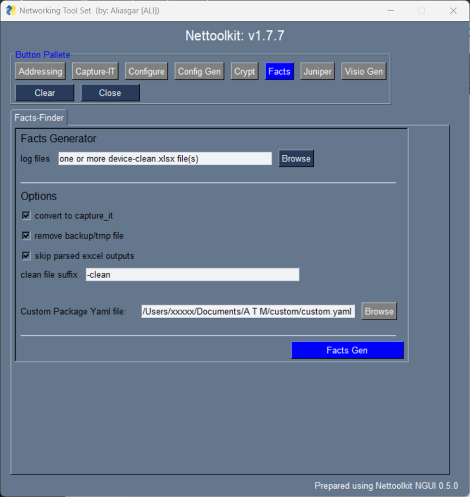

Image Gallery - facts finder
###############################################

* A Utility which helps generating device facts in user understandable excel format.
* It supports for *cisco-ios & juniper - switches & routers* for now.

Here is a few Keys and requirements to understand.

* Log Files: All it requires is capture-it log files, with a certain key command outputs. ( watch cli section for more details )

Other options are: 

* convert to capture-it: use this if captured output is not taken by capture-it utility.
* remove backup/tmp files: auto cleanup after processing.
* skip parsed excel files: Enable support for older textfsm output parser output merge in output.
* custom package yaml file: Yaml file containing custom package and class listing. ( more details below )

----

----

**Sample of customer.yaml**

.. code::

   facts_finder:
      CustomDeviceFactsClass: !!python/name:custom_factsgen.CustomDeviceFacts ''
      foreign_keys: !!python/name:custom_factsgen.FOREIGN_KEYS ''

Where,
We have a class named *CustomDeviceFacts* in a package custom_factsgen. [ referenced as **CustomDeviceFactsClass**]
Similarly, we have a dictionary defined named *FOREIGN_KEYS* in a package custom_factsgen. [ referenced as **foreign_keys**]

**CustomDeviceFactsClass:** A class which takes cleaned facts dictionary  as argument and work on it, to derive the additional custom attributes,
required to be added to clean output file.
**foreign_keys:** A Dictionary with list of additional fields required to be added to clean excel file. ( custom fields mentioned here, only those will be permitted to be add in clean files.)
FOREIGN_KEYS = {
'bgp':[ "router_id", ],
'vrf':["vrf_vpnid", "vrfcolor", ],
'interfaces':[ "int_type",  "int_type", "int_description", ],
}