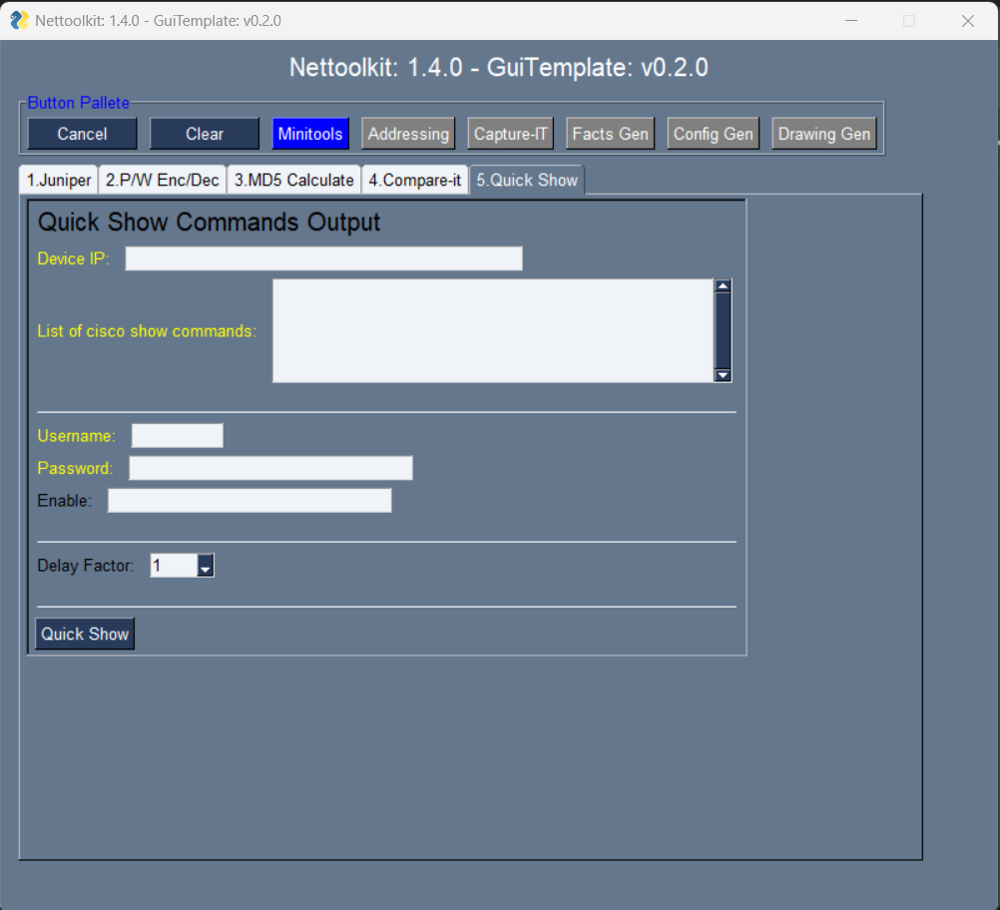

Image Gallery - Minitools
###############################################

.. figure:: img/juniper_to_set.png
   :scale: 25%
   :alt: Aliasgar Hozaifa Lokhandwala
   :align: right

+-----------------------------------------------------------------------------+
| **Juniper Operations**                                                      |
+=============================================================================+
|  #. convert juniper standard bracket configuration to set commands          |
|  #. remove remarks from juniper standard configurations                     |
|     makes comparision easy                                                  |
|                                                                             |
|  * **inputs:** a juniper bracket configuration file, destination folder     |
|  * **output:** text output file                                             |
+-----------------------------------------------------------------------------+

----

.. figure:: img/pw_enc_dec.png
   :scale: 25%
   :alt: Aliasgar Hozaifa Lokhandwala
   :align: left

+-----------------------------------------------------------------------------+
| **Password Encryption/Decryption Utility**\                                 |
+=============================================================================+
|  #. Cisco type-7 hash decrypt/encrypt                                       |
|  #. Juniper $9 password decrypt/encrypt                                     |
|     Note: Generated encrypted string can be different each time.            |
|                                                                             |
|  * **input:** password string                                               |
|  * **output:** encrypted/decrypted password string                          |
+-----------------------------------------------------------------------------+

----

.. figure:: img/md5_calculate.png
   :scale: 25%
   :alt: Aliasgar Hozaifa Lokhandwala
   :align: right

+-----------------------------------------------------------------------------+
| **MD5 calculator**\                                                         |
+=============================================================================+
|  #. Calculate MD5 hash value for a selected file                            |
|     Note: Do not use this for SHA hash generation.                          |
|                                                                             |
|  * **input:** a file                                                        |
|  * **output:** calculated MD5 has value on textbox                          |
|                                                                             |
+-----------------------------------------------------------------------------+

----

.. figure:: img/compare_it.png
   :scale: 25%
   :alt: Aliasgar Hozaifa Lokhandwala
   :align: left

+-----------------------------------------------------------------------------+
| **compare-it**\                                                             |
+=============================================================================+
|  #. Useful to spot differences in two text configuration files.             |
|  #. Useful to spot differences in two excel file (one tab at a time)        |
|                                                                             |
|  * **input:** two files (Either texts or excels)                            |
|  * **output:** text file with differences listed                            |
|                                                                             |
+-----------------------------------------------------------------------------+

----

+-----------------------------------------------------------------------------+
| **quick-show**\                                                             |
+=============================================================================+
|  #. quickly see command(s) output on console.                               |
|                                                                             |
|  * **input:** device-ip, show commands, credentials,                        |
|    delay factor( to wait before next command )                              |
|  * **output:** output on console                                            |
+-----------------------------------------------------------------------------+

