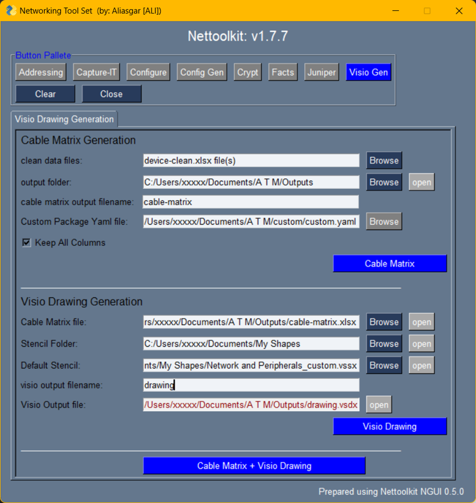

Visio Gen Tab
-------------------------

* A Utility which helps **generating cabling matrix** and than **visio drawing** based on provided devices facts files..
* Microsoft visio is required to be installed. ( tested on visio 2013, prior versions may or may not compatible )
* *Windows OS* is required. since Unix/Linux/Mac OS cannot interact with win32com libraries.

Here is a few Keys and requirements to understand.

* ``Clean Data Files``: Select all devices clean excel data files, required for a drawing.
* ``stencil folder``: Path where visio stencils are stored.
* ``default stencil``: default stencil name, to be chose, if no stencil name present in cable matrix excel.
* ``output folder``: Path where output cable matrix and visio will be stored.
* ``custom package yaml file``: Yaml file containing custom package and class listing. ( more details below )
* ``sheet filters``: dictionary of connection filters. A separate visio tab will be generated based on provided sheet filters.  sheet filters should be selected accordingly via custom code to add to cabling page.

----

----

**Sample of customer.yaml**

.. code::

   pyvig:
      custom_functions:    
         hierarchical_order : !!python/name:custom_pyvig.general.hierarchical_order_series ''
         item : !!python/name:custom_pyvig.general.sw_type_series ''

      custom_var_functions:
         ip_address : !!python/name:custom_pyvig.general.get_dev_mgmt_ip ''

      update:
         sheet_filter_columns_add : !!python/name:custom_pyvig.general.add_sheet_filter_columns ''

      sheet_filter:
         get_sheet_filter_columns : !!python/name:custom_pyvig.general.get_sheet_filter_columns ''

Where,
we have a few mandatory functions: 

   * *custom_functions.hierarchical_order* : this defines the structure of drawing, on which device will go on top and which will go bottom.  (ie. hierarchy Levels) 
   * *item*: this defines item from the default stencil. based on this selection necessary icon will get placed on to plane.

And a few optional functions: 
   
   * *custom_var_functions.ip_address*: defines ip address of device, to add to device description. We can have as many definitions as we want here

sheet filter requiremnets:

   * *update.sheet_filter_columns_add*:  Adds sheet filter columns to cabling data 
   * *sheet_filter.get_sheet_filter_columns*: retrive sheet_filters dynamically for those added using above update method.
