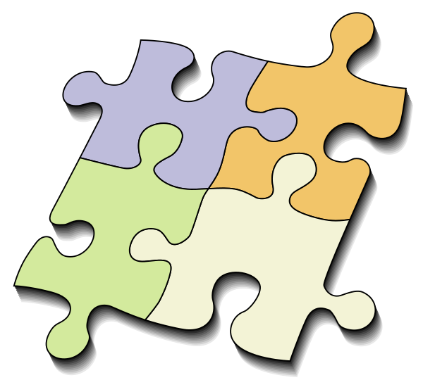

NGui Explained
============================================

You can use the NGui class to do GUI stuff for you. 

   * Declare some variables and frames. Attach those to appropriate structure and boom!!!  NGui interface will be ready for you.
   * Modify as you need to change the appearance. 
   * Bind appropriate methods to run the tasks when an event is called. 

* Follow Below steps in order to create your own GUI Frames in Python using Nettoolkit interface hooks.
* Backend Credit: ``PySimpleGUI``

#. First thing first.  Lets define a Buttons and Frames (aka: Layout) of your GUI. For example below, we took two group of screens where group1 has two frames inside, while group2 has a single frame inside.

    .. code-block:: python

        # ---------------------------------------------------------------------------------------
        #  Necessary Project imports
        # ---------------------------------------------------------------------------------------
        from collections import OrderedDict
        # ---------------------------------------------------------------------------------------
        #   Creating 'Buttons' and ascociate each with a group name
        # ---------------------------------------------------------------------------------------
        BUTTUN_PALLETE_DIC = OrderedDict()
        BUTTUN_PALLETE_DIC["My Group1"] = 'grp1_frames'
        BUTTUN_PALLETE_DIC["My Group2"] = 'grp2_frames'
        # ... Add more buttons as necessary

#. Now lets define a few functions which will return Frames.

    .. code-block:: python

        # -----------------------------------------------------------------------------------
        #  Import form items from nettoolkit
        # -----------------------------------------------------------------------------------
        from nettoolkit.nettoolkit.forms.formitems import *

        # -----------------------------------------------------------------------------------
        #  Define all your frames here 
        # -----------------------------------------------------------------------------------

        ## This is frame 1 of group1 
        def group1_frame1():
            return sg.Frame(title=None, 
                            relief=sg.RELIEF_SUNKEN, 
                            layout=[

                [sg.Text('Group1 - Frame1 Contents and your frame items will go here...'),],
                under_line(80),
                [sg.Button("Click to run", change_submits=True, key='btn1')],
                under_line(80),
                ])

        ## This is frame 2 of group1 
        def group1_frame2():
            return sg.Frame(title=None, 
                            relief=sg.RELIEF_SUNKEN, 
                            layout=[

                [sg.Text('Group1 - Frame2 Contents and your frame items will go here...'),],
                under_line(80),
                [sg.Checkbox('Event which trigger some field update', key='cb1', change_submits=True)],
                [sg.Text("Field which will be updated by below trigger"),sg.InputText(key='txt1')],
                under_line(80),
                ])

        ## This is frame 1 of group2 
        def group2_frame1():
            return sg.Frame(title=None, 
                            relief=sg.RELIEF_SUNKEN, 
                            layout=[

                [sg.Text('Group2 Contents and your frame items will go here...'),],
                under_line(80),
                [sg.Button("Click to run", change_submits=True, key='btn2')],
                under_line(80),
                ])

        ## ... Define more as needed

#. Its time to tie them together.

    .. code-block:: python

        # ---------------------------------------------------------------------------------------
        #  Create Frame groups and ascociate frame descriptions for each frames definition to it
        # ---------------------------------------------------------------------------------------
        GROUP1_FRAME = {
            'G1_Frame1_Description': group1_frame1(),
            'G1_Frame2_Description': group1_frame2(),
        }
        GROUP2_FRAME = {
            'G2_Frame1_Description': group2_frame1()
        }
        # ... Add more Frame_Groups as necessary

        # ---------------------------------------------------------------------------------------
        #  Collage of all Group of Frames
        # ---------------------------------------------------------------------------------------
        FRAMES = {}
        FRAMES.update(GROUP1_FRAME)
        FRAMES.update(GROUP2_FRAME)

        # ---------------------------------------------------------------------------------------
        #  Create a set of all Frame/Tab names/keys 
        # ---------------------------------------------------------------------------------------
        ALL_TABS = set()
        ALL_TABS = ALL_TABS.union(GROUP1_FRAME.keys())
        ALL_TABS = ALL_TABS.union(GROUP2_FRAME.keys())
        # ... Add more frames as necessary

#. Here is we defining a few functions which will get called when we click a particular group button. And ultimately it will show its child frames and hide all other frames.

    .. code-block:: python

        # ---------------------------------------------------------------------------------------
        #  Necessary Project imports
        # ---------------------------------------------------------------------------------------
        from nettoolkit.nettoolkit.forms.tab_event_funcs import enable_disable

        # ---------------------------------------------------------------------------------------
        #  Define execution functions to enable group of frames ascociated with that 'Button'
        # ---------------------------------------------------------------------------------------
        def g1_btn_exec(obj):
            enable_disable(obj, 
                group='grp1_frames', 
                group_frames=GROUP1_FRAME.keys(),  
                all_tabs=ALL_TABS, 
                event_updaters=set(BUTTUN_PALLETE_DIC.values())
            )
            return True

        def g2_btn_exec(obj):
            enable_disable(obj, 
                group='grp2_frames', 
                group_frames=GROUP2_FRAME.keys(), 
                all_tabs=ALL_TABS, 
                event_updaters=set(BUTTUN_PALLETE_DIC.values())
            )
            return True

        # ... Add more fn as necessary

#. So now lets change our direction and define a few event_updator functions and event_executor functions.

    .. code-block:: python

        import PySimpleGUI as sg

        # ================================================================================
        #  OBJ EVENT UPDATOR FUNCTIONS
        #    these functions will accept two arguments. first is NGui object iself and
        #    second will be [i] item list of object
        # ================================================================================

        def g1_f2_cb1_executor(obj, i):
            s = "You have presesed a button from Group 1 Frame 2, text box value will be append with X"
            print(s)
            new_text = i['txt1'] + "X"
            obj.event_update_element(txt1={'value': new_text})		
            return True    ###  Always return True to detect all tasks completed

        # ================================================================================
        #  Some Executor Functions
        #   Such functions will accept only [i] item list of NGui object. 
        # ================================================================================

        def g1_f1_btn1_executor(i):
            s = "You have presesed a button from Group 1 Frame 1"
            print(s)
            sg.Popup(s)
            return True    ###  Always return True to detect all tasks completed

        def g2_f1_btn2_executor(i):
            s = "You have presesed a button from Group 2 Frame 1"
            print(s)
            sg.Popup(s)
            return True    ###  Always return True to detect all tasks completed

#. So far so good, Lets now define a dictionary which has event keys bound with its event executor/updator functions(above).

    .. code-block:: python

        # ---------------------------------- #
        #         EVENT FUNCTIONS            #
        # ---------------------------------- #

        # ---------------------------------------------------------------------------------------
        #  Make arbitrary number of dictionaries of event updators v/s its executor functions.
        # ---------------------------------------------------------------------------------------

        ## Functions which calls for individual button press
        BUTTON_PALLET_EVENT_FUNCS = {
            'grp1_frames': g1_btn_exec,
            'grp2_frames': g2_btn_exec,
        }

        ## Group buttons events
        GROUP1_EVENT_FUNCS = {
            'btn1': g1_f1_btn1_executor,
            'cb1': g1_f2_cb1_executor,
        }
        GROUP2_EVENT_FUNCS = {
            'btn2': g2_f1_btn2_executor,
        }

        # ---------------------------------------------------------------------------------------
        #  Collage all those above in to a single EVENT_FUNCTIONS dictionary
        # ---------------------------------------------------------------------------------------
        EVENT_FUNCTIONS = {}
        EVENT_FUNCTIONS.update(BUTTON_PALLET_EVENT_FUNCS)
        EVENT_FUNCTIONS.update(GROUP1_EVENT_FUNCS)
        EVENT_FUNCTIONS.update(GROUP2_EVENT_FUNCS)
        # ---------------------------------------------------------------------------------------

#. Similarly we need to define two sets which identifies which event keys are event updators, and which event keys are retractable.

    .. code-block:: python

        # ---------------------------------- #
        #         EVENT UPDATERS             #
        # ---------------------------------- #

        # ---------------------------------------------------------------------------------------
        #   list down variables which triggers an item update event
        # ---------------------------------------------------------------------------------------
        EVENT_UPDATERS1 = { 'cb1'}
        EVENT_UPDATERS2 = set()

        # --------------------------------- [ Club ] --------------------------------------------
        EVENT_UPDATORS = set()
        EVENT_UPDATORS = EVENT_UPDATORS.union(EVENT_UPDATERS1)
        EVENT_UPDATORS = EVENT_UPDATORS.union(EVENT_UPDATERS2)
        # ---------------------------------------------------------------------------------------

        # ---------------------------------- #
        #        RETRACTABLE KEYS            #
        # ---------------------------------- #

        # ---------------------------------------------------------------------------------------
        #  sets of retractable variables , which should be cleared up on clicking clear button
        # ---------------------------------------------------------------------------------------
        G1_RETRACTABLES = set()
        G2_RETRACTABLES = { 'txt1', }

        # --------------------------------- [ Club ] --------------------------------------------
        RETRACTABLES = set()
        RETRACTABLES = RETRACTABLES.union(G1_RETRACTABLES)
        RETRACTABLES = RETRACTABLES.union(G2_RETRACTABLES)
        # -------------------------------------------------------------------------

#. We are all set, Get Ready For The Show..

    .. code-block:: python

        # --------------------------------------------
        # IMPORT NGui
        # --------------------------------------------
        from nettoolkit import NGui

        # ----------------------------------------------------------------------------------
        #  Create an Instance of NGui
        #  Options are optional, and can be set as propery as well after instance is created. 
        # ----------------------------------------------------------------------------------
        NG = NGui(
            header = "My Custom Project - X",
            banner = "Project X - Which does something",
            form_width = 800,
            form_height = 400,
            button_pallete_dic = BUTTUN_PALLETE_DIC,
            frames_dict = FRAMES,
            event_catchers = EVENT_FUNCTIONS,
            event_updaters = EVENT_UPDATORS,
            retractables = RETRACTABLES,
        )

        # ----------------------------------------------------------------------------------
        #  Call for an instance, by providing optional initial frame group definition
        #  no initial frame group will show all frames at initialization
        # ----------------------------------------------------------------------------------
        NG(g1_btn_exec)

        # ----------------------------------------------------------------------------------
        #  Release Memory after window closed
        # ----------------------------------------------------------------------------------
        del(NG)

.. important::
    
    **Parameters for NGui**

    * ``header`` **(string)** Header for the window (default: None)
    * ``banner`` **(string)** Banner to display in window (default: None)
    * ``form_width`` **(integer)** Form width (default: 700)
    * ``form_height`` **(integer)** Form Height (default: 1440)
    * ``button_pallete_dic`` **(dict)** Dictionary which defines additonal buttons on button pallete ( Default: None )
    * ``frames_dict`` **(dict)** Dictionary which defines all individual frames, and its derived function which returns sg.Frame object ( Default: None).
    * ``event_catchers`` **(set)** Set of event catcher element keys (default: None)
    * ``event_updaters`` **(set)** Set of event updator element keys (default: None)
    * ``retractables`` **(set)** Set of element keys which can be cleanup when pressing clean button.

.. note::
    
    **Parameters for NGui**

    * All these arguments are optionals to declare whilst creating the object instance. And can be later define  by propery assignment ( ex: **NG.header = "Some header"** ).
    * Although all of these are optionals to declare at beginning, some of the arguments are required ones to provide before calling the NGui class in order to work properly.. 
    * If you call NGui, without providing ``button_pallete_dic`` and without **initial frame group definition**. GUI will rendered with all frames with no buttons on button pallete.
    * Similarly if you call NGui, without providing ``frames_dict`` and without **initial frame group definition**, GUI will not render any frames instead it will only display buttons on button pallete.
    * Calling NGui without **initial frame group definition** leads to no filter on frames while loading new window.

------

@Decorator popupmsg()
============================================

    * ``pre`` **(str, optional)**: Popup Message to display before function execution. Defaults to None.
    * ``post`` **(str, optional)**: Popup Message to display after function execution. Defaults to None.

    .. code-block:: python

        from nettoolkit.nettoolkit.forms.formitems import popupmsg

        @popupmsg(pre="Popup msg before bfunction run", 
                 post="Popup msg after function run")
        def foo():
            pass

